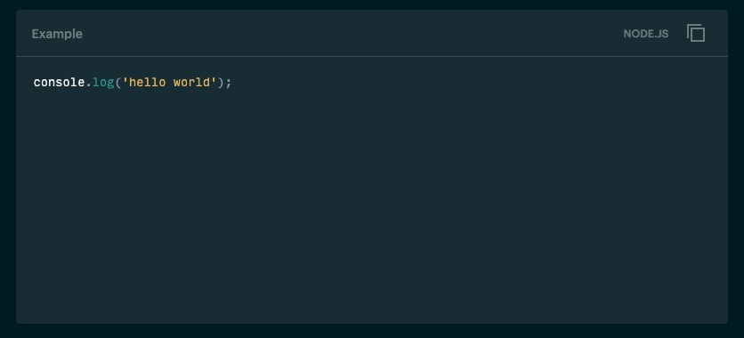
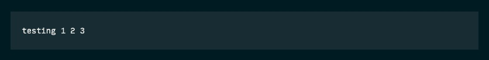
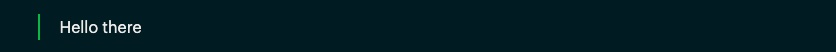

<p align="center">
  <a href="https://mailchimp.com/developer/">
    
  </a>
</p>

# Mailchimp Open Commerce docs

This repo hosts the open source documentation for [Mailchimp Open Commerce](https://mailchimp.com/developer/open-commerce/) (formerly Reaction Commerce). Previous versions of the Reaction Commerce docs are archived in [a separate repo](https://github.com/reactioncommerce/reaction-docs).

## Markdown and custom syntax

The files in this repo are the source content for the [Open Commerce docs](https://mailchimp.com/developer/open-commerce/docs/) on the [Mailchimp Developer](https://mailchimp.com/developer/) site. 

To render properly on the developer site, all docs should be written in Markdown. Some standard Markdown elements are not supported: **avoid** H3, H4, H5, and H6 headers, as well as nested lists. 

The developer site does support some Markdown-compatible custom components:

### Code snippets

Delimit code blocks with triple backticks as in standard Markdown. You can optionally add a [GitHub-flavored Markdown language](https://docs.github.com/en/github/writing-on-github/creating-and-highlighting-code-blocks#syntax-highlighting) and a `title` parameter:

<pre>
```js title=Example
console.log('hello world');
```
</pre>



The title parameter [cannot contain whitespace](https://github.com/mdx-js/mdx/issues/702), so we recommend only using it for filenames, indicating the location of the referenced code.

Code blocks without a language and title are rendered in a plain module:

<pre>
```
testing 1 2 3
```
</pre>



### Note blocks

Create custom note blocks by starting a blockquote with the string `**Note**: `:

<pre>
> **Note**: hello there
</pre>


Other blockquotes will be rendered normally:

<pre>
> Hello there
</pre> 



## Contributing

Contributions to this repo are welcome. Please submit an issue or pull request if you feel any information is incomplete or inaccurate.

Approved changes will also be published on the Mailchimp Developer site, although they will not appear there immediately.
