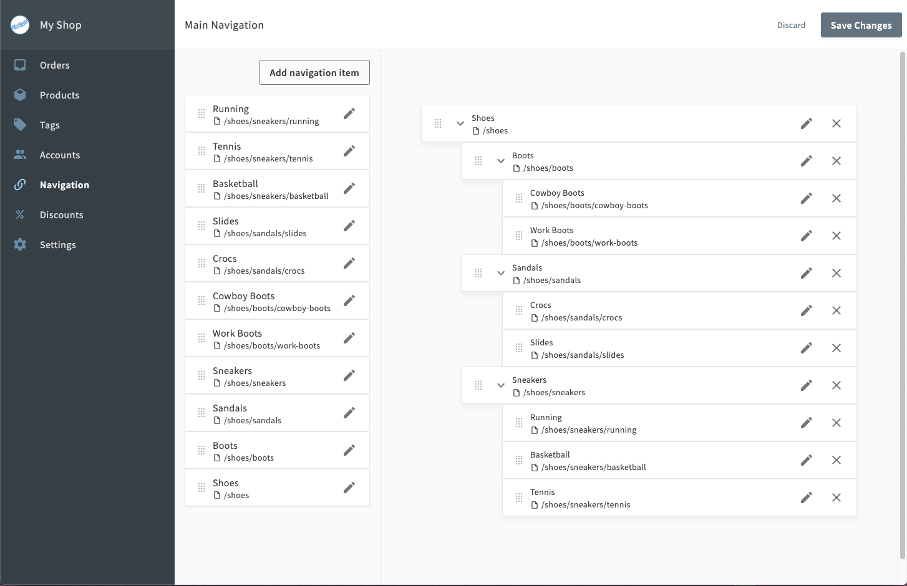

## The basics

Open Commerce gives you a flexible way to organize your products with tags. Tags are shopper-facing and applied at the product level, and multiple tags can be assigned to any product. (Variants cannot have their own tags, so you should consider that when [organizing your products and variants](/open-commerce/docs/creating-organizing-products/).) 

Tags are also the basis for creating navigation items, which appear when browsing the shop. Each navigation item is linked to a particular tag, and navigation items can be nested within one another to create a hierarchy. The navigation hierarchy is also reflected in the breadcrumbs shown on each product detail page.

In this documentation, we’ll cover how to create tags, organize them, and use them to build hierarchical navigation. 

## Creating and assigning tags

To create a tag, log in to the Open Commerce admin dashboard, click **Tags** in the left sidebar, and click **Create a tag**. Enter the tag name, display title, and slug. If you want the tag to appear immediately, check **Tag is enabled in storefront**.

Tag names and slugs must be unique within a shop, which is important to remember when creating tags designed for a multi-level hierarchy. The process for creating a tag is the same regardless of what level of the navigation hierarchy it will occupy, so when creating child tags, it’s a good idea to include the parent tag in the name and slug to prevent conflicts. 

For example, a store selling language textbooks could have tags with the slugs `french`, `french-beginner`, and `french-advanced`, as well as `mandarin`, `mandarin-beginner`, and `mandarin-advanced`, but it could not have different tags with the slug `beginner` for each language. Despite this limitation, different tags _can_ have the same shopper-facing display title—`french-beginner` and `mandarin-beginner` could both have the display title "Beginner".

After creating tags, you can use them to indicate what categories a product belongs to. If you've created a hierarchical tag system and you want a product to appear at all levels of the hierarchy, you will need to assign it multiple tags, such as tagging a beginner French textbook with both `french-beginner` and `french`. For more information on assigning tags to products, see [Creating and Organizing Products](creating-and-organizing-products).

## Creating navigation items

Tags themselves are not organized hierarchically. To create a hierarchical organization and have it display in your shop, you must create navigation items, each of which corresponds to a single tag. 

To create a navigation item, click **Navigation** in the left sidebar and then click **Add navigation item**. In the dialog, fill out the following fields:

| Field | Description |
|-------|-------------|
|Display Name|The name that will appear in the shop navigation.|
|URL|Enter `/tag/YOUR_TAG_SLUG`. The leading slash is required.|
|This URL is relative|Check this box.|
	
Once you have created your navigation items, drag and drop them from the left-hand list of all items into the right-hand list of active items. You can organize the active navigation items as you want by dragging an item vertically to change its position in the list or horizontally to change its level of nesting.

When added to the hierarchy, navigation items are hidden by default. To show a navigation item, click the pencil icon next to its name in the the right-hand list and check **Show in storefront**.