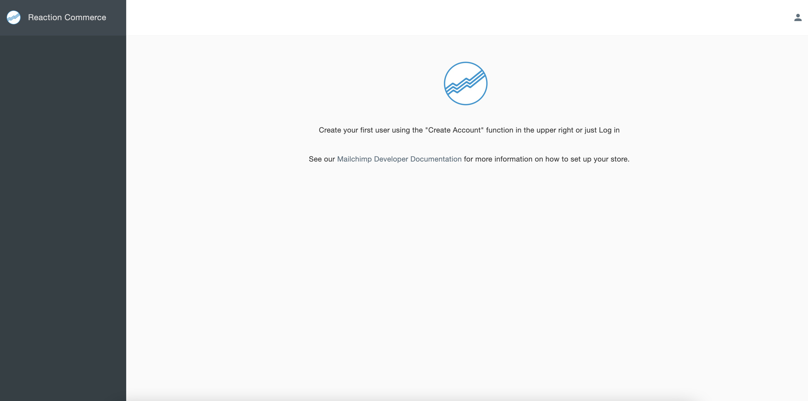
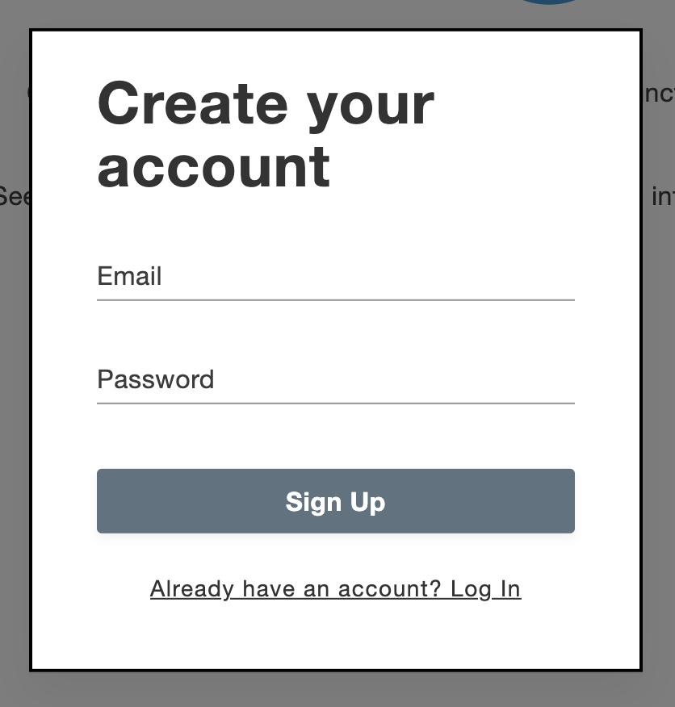

# Create a user

Congratulations on a successful installation of Open Commerce. Now you should have the admin portal available at http://localhost:4080/

To create a user click on the profile icon in the top right corner on the screen. It will show you options to Sign In or Create Account.

Click on Create Account to bring up the sign-up window.

This will require an email ID and a password. There are no password requirements enforced, but we suggest you use a strong password. The first user created is by default added to the account-manager, system-manager and owner groups. Any consecutive users created do not directly qualify into any permission groups. The shop owner can assign the role to the rest of the users. Learn more about groups and permissions [here](groups-and-permissions.md).