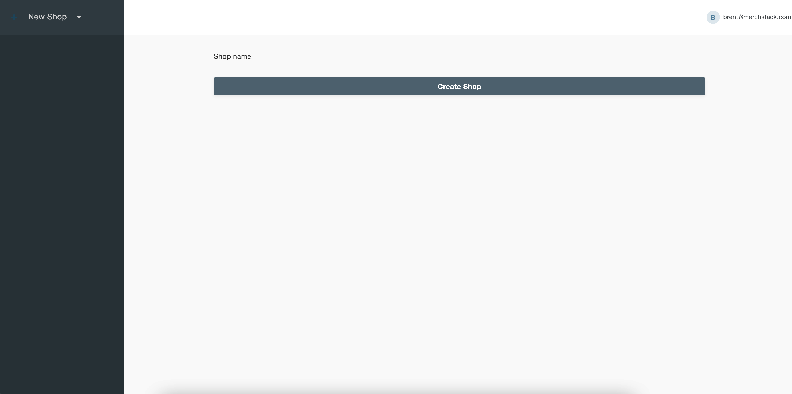
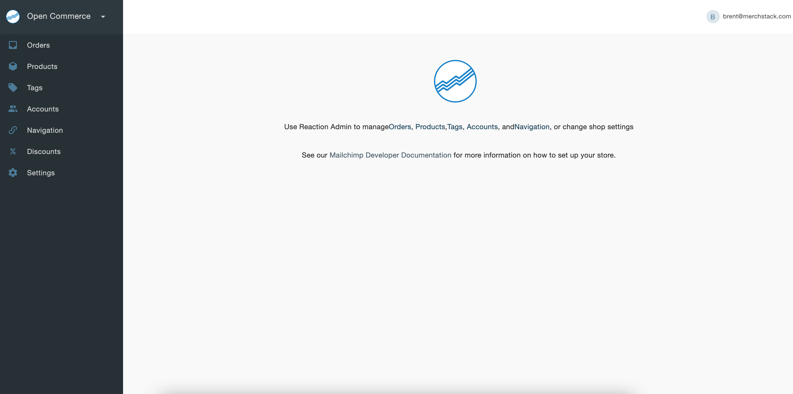

# Create a shop

Creating a shop is the first prompt that pops up after creating the first user. Enter the name of the shop in the text field and click the Create Shop button to successfully create a shop. The first shop created is by default the primary shop type. Each Open Commerce installation may have only one primary shop. Any consecutive store created is a merchant shop type.

This brings us to multitenancy which means you can create multiple shops using Open Commerce. You can create additional shops by clicking on your shop name in the upper left corner of the screen. This will expand a drop-down menu with the New Shop option at the bottom.

Clicking on it will bring you to the Create Shop page.
Follow the same instruction as above to create another shop. This new shop is assigned a merchant shop type.

Once you have multiple shops you can switch between them within the admin portal. Click on the shop name in the upper left corner of the screen. The dropdown will display a list of all the shops created along with the New Shop option at the end. Click on the shop of your choice to switch to it.

Once you have created a user and set up a shop, the admin portal will look like this.
