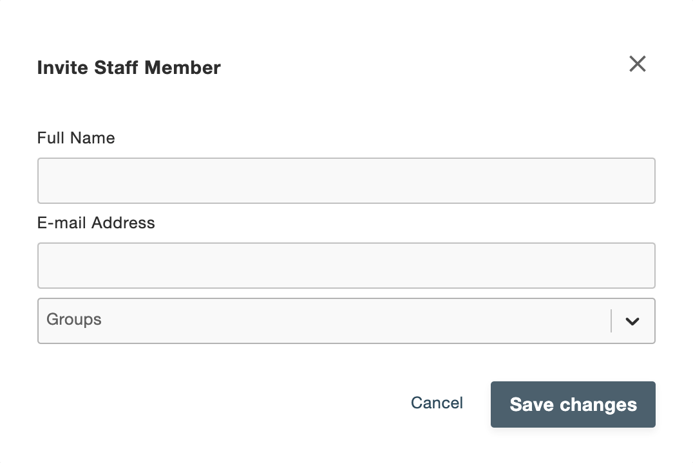

# Accounts

You'll find account management and settings options by clicking Accounts in the side menu of the Open Commerce Admin portal.

Within Accounts you can access the following options::
- Staff Members: View and modify the accounts involved with shop management and the different permission groups to which they belong. The first account created is populated under Owner. You can also create additional groups and invite users here.
- Customers: View customers of the shop..
- Invitations: View the outstanding sent invitations. Once the user accepts an invitation it is no longer shown here.

## Create Group

To create a new group, click Create Group under Staff Members, and add the following information in the pop-up modal:
- Name: Group name. Required.
- Slug: A URL-friendly slug. Optional. If you don't provide this, the group name is used as the slug.
- Description: A brief description of the group. Optional.
- Roles: Select the appropriate permissions for the group from the dropdown menu. You can create, modify and delete permissions for different features of the app here.

Don't forget to save your changes!

## Invite Staff Member

You can invite people to be a part of your shop management by clicking Invite Staff Member. You'll need to enter their Name and Email ID, and then you can select the groups to which you want to add this member.

Once you've successfully sent the invitation, the recipient should receive an email.

> Note: You'll need to set up an email service to send out invitations. See [Email Configuration](75-email-configuration.md) for more information.