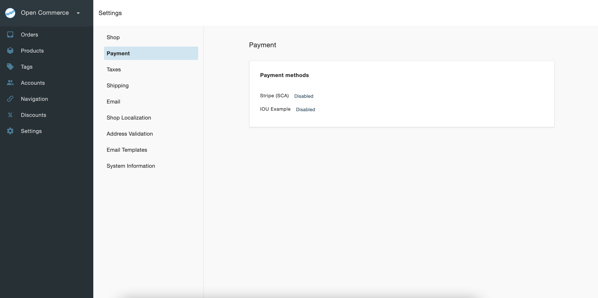

# Payments

To setup Payments go to the admin and select Settings in the side bar and select Payments. You will see a list of payment methods with a button to enable or disable that payment option. The enabled payment methods are visible to the customer at checkout. 

Open commerce comes with a [Stripe](https://stripe.com/) plugin for payments. The new plugin is [SCA complient](https://stripe.com/docs/strong-customer-authentication).