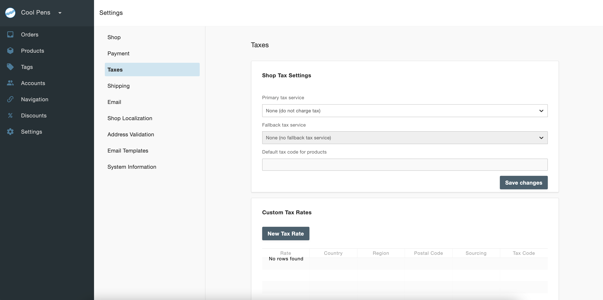
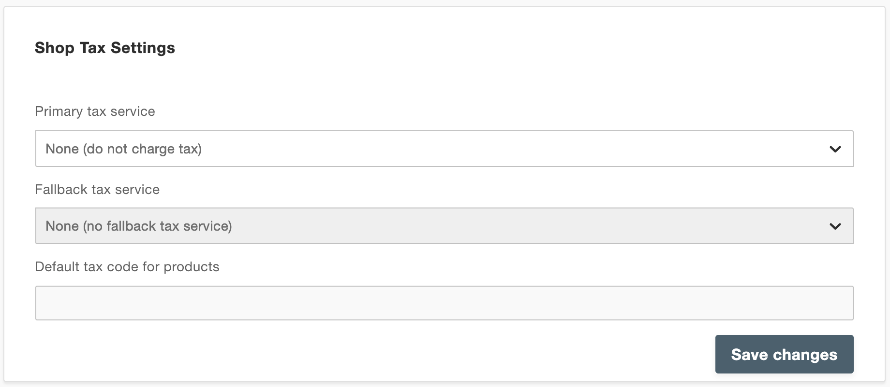
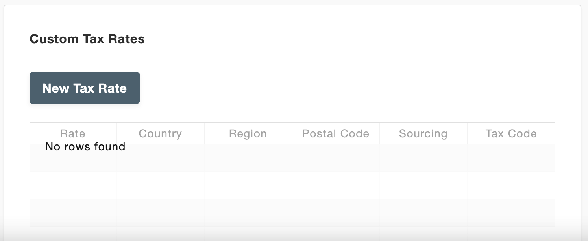
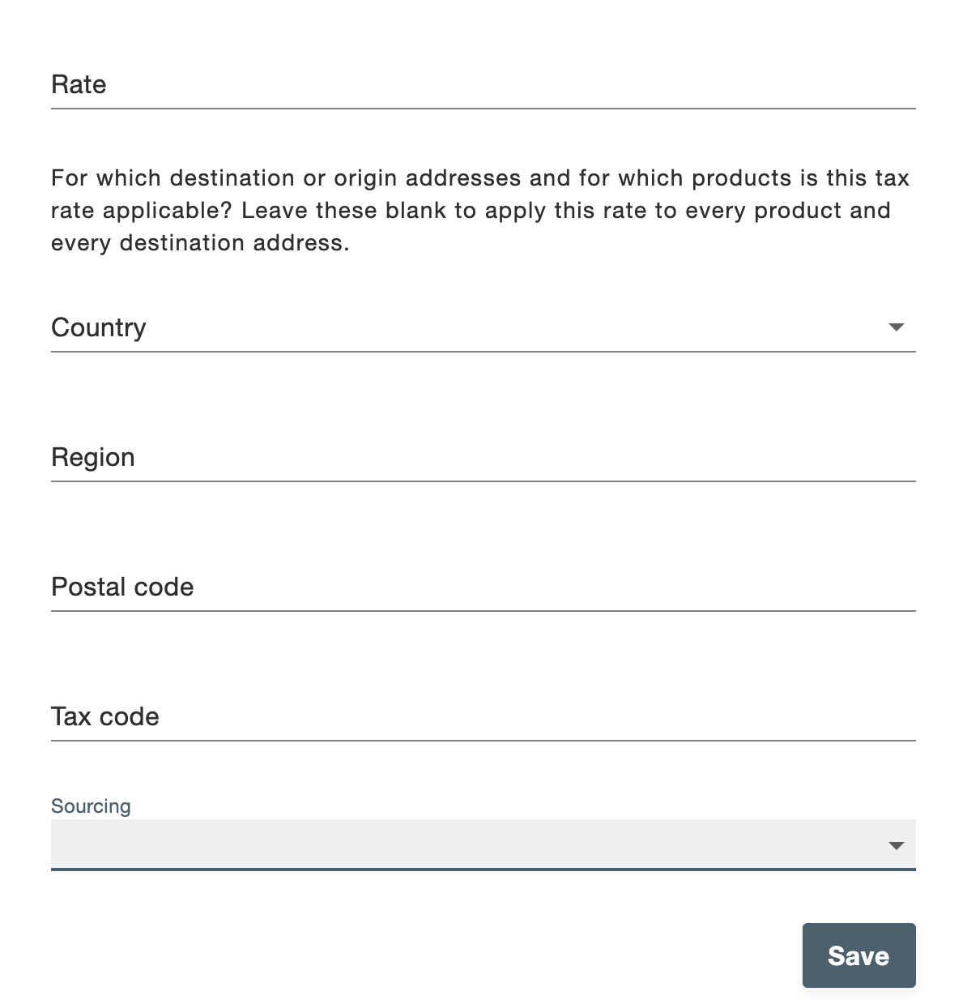

# Taxes

To set up Taxes, go to **Settings > Taxes** in the admin dashboard.

Select whether to add tax charges to products. If you do choose to add tax charges, select Custom Rates to define the tax rate you'll be using in the Custom Tax Rates table. Note that the default tax code for products applies to all products. The tax codes can be created in the Custom Tax Rates table below. Finally, click Save changes to save the settings.

To create a Custom Tax Rate, click New Tax Rates and fill in the fields on the pop-up modal.

- **Rate**: The percentage tax that needs to be applied.
- **Country**: The origin or destination country for which the tax rates apply. Leave this blank if you want it to apply to any Country.
- **Region**: The origin or destination region for which the tax rates apply. Leave this blank if you want it to apply to any Region.
- **Postal code**: The origin or destination postal code for which the tax rates apply. Leave this blank if you want it to apply to any Postal code.
- **Tax code**: An identifier or name for the tax rate.
- **Sourcing**: You can pick between Origin and Destination. This allows different tax rates to be calculated based on the country, state or even ZIP code of the sender or receiver.

Finally, click **Save changes** to save your new settings.

>Note: Leaving all fields (Country, Region, Postal code and Sourcing) blank applies this rate to every product and every destination address. Generally, we recommend creating a tax rates for one specific country or geographic region per rate.