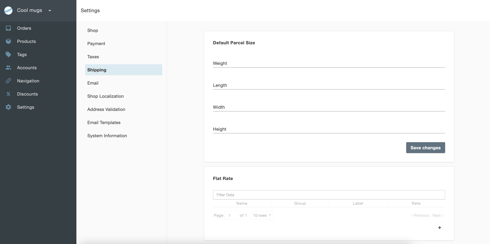
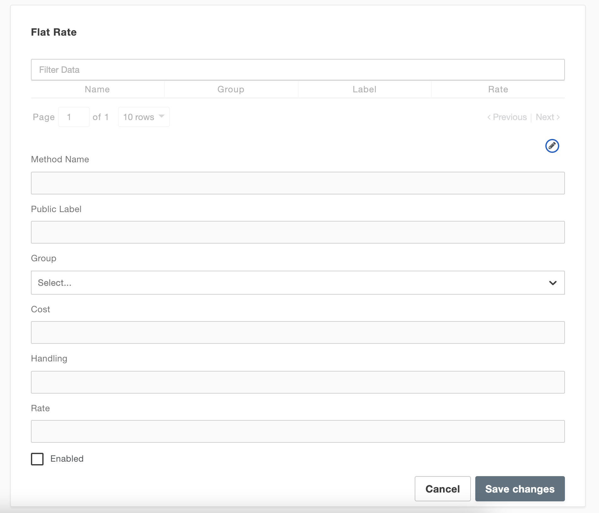
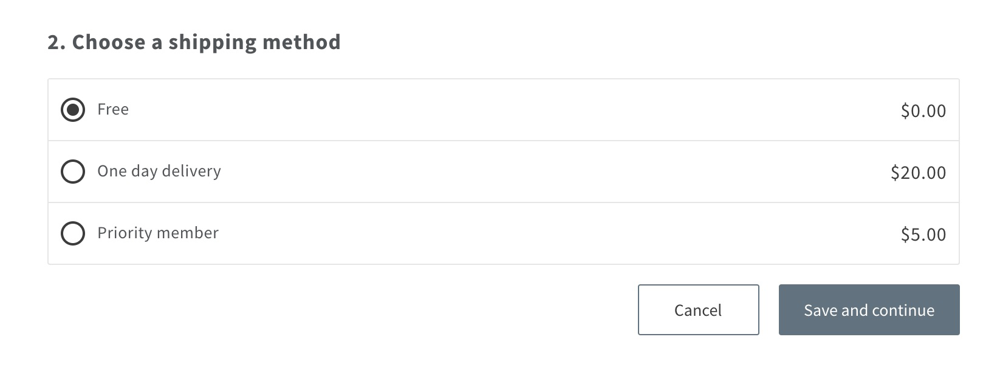

# Shipping method

To set up a shipping method, go to **Settings > Shipping** in the admin dashboard and then scroll to click the **plus icon (+)** under **Flat Rate**. Fill in the following information.

- **Method Name**: A unique name to identify the shipping method. This name is not visible to the public. The admin can use detailed names to identify a method among many.
- **Public Label**: The shipping method name seen on the storefront by the customer during checkout.
- **Group**: Select from a dropdown list consisting of Free, Ground, One day, and Priority to help you organize your various shipping methods.
- **Cost**: Your cost, as a shop owner, to ship this item.
- **Handling**: The handling price you'll charge for this shipping method at checkout.
- **Rate**: The shipping price you'll charge for this shipping method at checkout.
- **Enabled**: Select this to make the option visible on the storefront.

Finally, click **Save changes** to save your new settings.

Shipping methods enabled at storefront on checkout.
