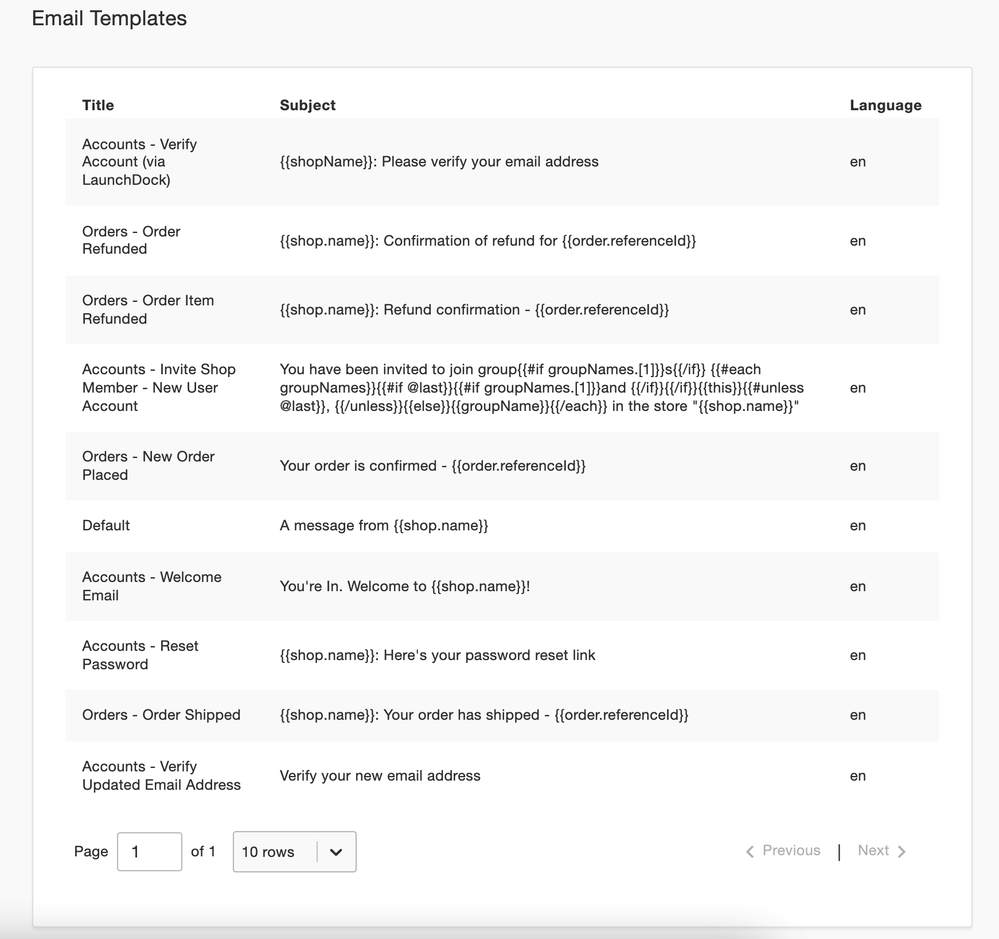

# Email templates

A range of email templates are preloaded into the `Templates` collection when Open Commerce starts up.

Accounts:
- Invite Shop Member – New User Account
- Reset Password
- Verify Account (via LaunchDock)
- Verify Updated Email Address
- Welcome Email

Orders:
- New Order Placed
- Order Item Refunded
- Order Refunded
- Order Shipped

To customize a template, go to **Settings > Email Templates** in the admin dashboard. There are several fields that define each template: 

| Field | Description |
|-------|-------------|
|Title|A user-friendly name for the type of email.|
|Subject|The email subject line. [Handlebars expressions](https://handlebarsjs.com/guide/) are allowed, as long as they are passed to the server-side rendering function.|
|HTML|The body of the email. [Handlebars expressions](https://handlebarsjs.com/guide/) are allowed, as long as they are passed to the server-side rendering function.|
|Name|Not editable. The name of the function that is used to trigger the email.|
|Language|Not editable. The language that is set for the shop under **Settings > Shop Localization**. The language can’t be changed on a per-template basis.|
