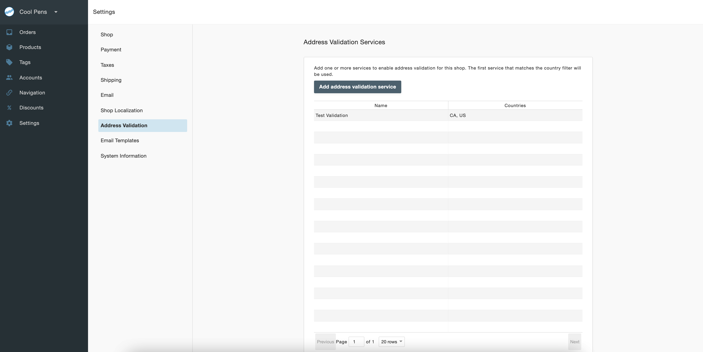
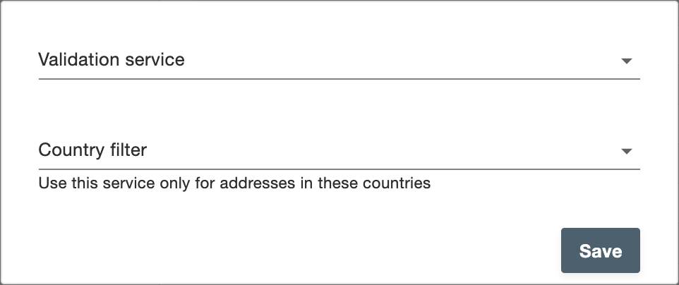

# Address validation

You can find settings for the for Address Validation under **Settings > Address Validation** on the admin dashboard.

To add a new address validation service, click **Add Address Validation Services** and fill in the information on the pop-up modal.

- **Validation service**: The list of address validation services that have been set up with the application, including a default Test Validation for testing.
- **Country filter**: The countries to which the address validation should apply.
